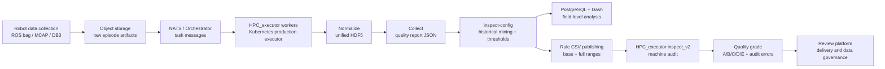
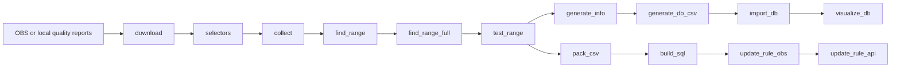

# inspect-config

[English](README.md) | [中文](README.zh-CN.md)


Configuration-driven quality governance for large-scale robot telemetry.

`inspect-config` is the offline rule-generation, reporting, database, and visualization layer of a larger data quality system. It works with `HPC_executor / production executor`, a Kubernetes/NATS-driven worker pipeline that normalizes raw robotics data, collects structured quality reports, runs machine audit rules, and returns quality grades to downstream data platforms.

This README is written as a GitHub-friendly case study: it documents how this repository works while also showing the architecture, engineering decisions, and impact behind the full system.

## Case Study Snapshot

- **Problem**: manual review could not reliably catch frame drops, camera stalls, joint anomalies, missing fields, or model-specific quality drift across large telemetry datasets.
- **Solution**: build a closed-loop quality governance system where production workers generate quality reports, `inspect-config` mines historical reports into dynamic audit ranges, and the executor uses those ranges for automated machine review.
- **Result**: field-level anomaly detection, model-specific threshold generation, data quality grading, and dashboard-driven diagnosis for multi-configuration robot datasets.

## System Context

`inspect-config` is not the whole production system. It is the control-plane style component that turns historical quality reports into auditable rules and analysis views. `HPC_executor` is the execution plane that processes each episode in production.



In this architecture, `HPC_executor` handles the hot path: download, normalize, collect, inspect, align, extract, and upload. `inspect-config` handles the feedback loop: aggregate historical quality reports, infer field ranges, validate thresholds, publish rule CSV files, import reports into PostgreSQL, and provide a Dash dashboard for anomaly exploration.

## Project Value

- **Automated quality governance**: replaces manual field-by-field checks with structured quality reports and repeatable machine audit rules.
- **Dynamic multi-model rules**: generates model-specific thresholds from historical distributions while still allowing hard-coded delivery requirements to take priority.
- **Closed feedback loop**: production reports feed `inspect-config`; generated rule CSV files feed back into `HPC_executor inspect_v2`.
- **Quality grading**: supports A/B/C/D/E quality outcomes based on warning counts, severe anomalies, critical missing fields, and configuration validity.
- **Operational diagnosis**: Dash visualizations help compare anomalies by model, field, time, serial number, area, and task.
- **Delivery support**: quality levels and rule failures provide evidence for data review, anomaly localization, and downstream data packaging decisions.

## Scale & Impact

| Dimension | Sanitized scale |
| --- | --- |
| Quality report corpus | about 5 million episode-level JSON reports |
| Historical report size | about 250 GB of structured quality data |
| Production concurrency | about 50-80 Kubernetes worker pods consuming task queues |
| Quality fields | usually 70-100 fields per robot configuration |

These numbers are intentionally sanitized. Private bucket names, credentials, deployment paths, and internal service URLs are not included in this repository.

## My Role / Contributions

- Built the `collect` / `inspect` quality toolchain around structured quality report JSON files.
- Built `inspect-config` to download historical reports, generate selectors, estimate ranges, validate thresholds, and publish machine-audit rule CSV files.
- Added PostgreSQL ingestion and a Plotly Dash dashboard for field-level anomaly analysis.
- Connected generated configs back into `HPC_executor inspect_v2`, enabling dynamic machine audit V2 and quality grading.
- Developed production-side quality algorithms for frame stability, frame alignment, camera static intervals, joint motion intervals, joint range checks, and action/state curve fitting.

## inspect-config Pipeline

This repository is a configurable Python pipeline. Each step can be selected from `global.steps_to_run` while preserving the fixed execution order.



## Features

- **Config-first pipeline**: choose the active workflow from YAML without changing Python code.
- **Structured JSON extraction**: generate selectors from nested quality reports and collect matching values into CSV outputs.
- **Threshold generation**: estimate base and full ranges using configurable statistical methods.
- **Validation loop**: test generated ranges against collected values and surface failing fields.
- **Database export**: produce normalized CSV tables for PostgreSQL import.
- **Interactive visualization**: explore models, rule codes, fields, thresholds, and time ranges in a Dash/Plotly app.
- **Optional object-storage workflow**: download reports and upload generated rule artifacts through `obsutil` when configured.

## Requirements

- Python 3.11 or newer
- [uv](https://docs.astral.sh/uv/) for dependency management
- PostgreSQL for `import_db` and `visualize_db`
- `obsutil` only when running object-storage download or upload steps

## Quick Start

Install dependencies:

```bash
uv sync
```

Review the configuration:

```bash
cp config.local.yaml.example config.local.yaml
```

Run the configured pipeline:

```bash
uv run python src/run.py --config config.yaml
```

Run without side-effectful operations where supported by the configured steps:

```bash
uv run python src/run.py --config config.yaml --dry-run
```

Enable debug logging:

```bash
uv run python src/run.py --config config.yaml --debug
```

## Configuration

The pipeline is controlled by YAML files:

- `config.yaml`: shared project configuration and default step settings.
- `config.local.yaml.example`: local override template for machine-specific settings.
- `config.local.yaml`: ignored by Git and intended for private credentials, local paths, and database connection details.

Important sections:

- `global.steps_to_run`: selects which steps to run.
- `global.enabled_areas`: limits processing to selected areas when area filtering is enabled.
- `download`: controls report download behavior, CSV task-list mode, refresh policy, and parallelism.
- `selectors`, `collect`, `find_range`, `find_range_full`, `test_range`: define metric extraction and threshold validation behavior.
- `generate_db_csv` and `import_db`: prepare and load normalized PostgreSQL tables.
- `visualize_db`: configures the Dash server and database connection.
- `update_rule_obs` and `update_rule_api`: publish generated rule artifacts when those integrations are configured.

## Common Workflows

Run only the dashboard:

```yaml
global:
  steps_to_run:
    - visualize_db
```

Then start it:

```bash
uv run python src/run.py --config config.yaml
```

Prepare PostgreSQL with the bundled Compose file if you want a local database:

```bash
docker compose -f src/visualize_db_app/docker-compose.yml up -d
```

Generate database CSV files and import them:

```yaml
global:
  steps_to_run:
    - generate_db_csv
    - import_db
```

Run a threshold-generation pass from already downloaded reports:

```yaml
global:
  steps_to_run:
    - selectors
    - collect
    - find_range
    - find_range_full
    - test_range
```

## Project Structure

```text
.
├── config.yaml
├── config.local.yaml.example
├── pyproject.toml
├── src
│   ├── run.py
│   ├── core
│   │   ├── config_loader.py
│   │   ├── logger.py
│   │   ├── pipeline.py
│   │   └── step_registry.py
│   ├── steps
│   │   ├── download.py
│   │   ├── selectors.py
│   │   ├── collect.py
│   │   ├── find_range.py
│   │   ├── generate_db_csv.py
│   │   ├── import_db.py
│   │   └── visualize_db.py
│   └── visualize_db_app
│       ├── app.py
│       ├── callbacks.py
│       ├── charts.py
│       ├── database.py
│       └── layout.py
└── uv.lock
```

## Security Notes

- Do not commit object-storage access keys, database passwords, API tokens, bucket names, internal URLs, or real production paths.
- Keep private overrides in `config.local.yaml`.
- Treat generated CSV exports, downloaded reports, and telemetry-derived data as potentially sensitive.
- Rotate any credential that was ever committed or shared in plaintext.

## Development Notes

Each pipeline step lives in `src/steps` and exposes a `run_step(repo_root, global_cfg, step_cfg, runtime)` function. The step order is declared in `src/core/step_registry.py`, and `src/core/pipeline.py` handles runtime context sharing between steps.

The project intentionally keeps the runner small: behavior is expressed through step modules and YAML configuration instead of a large command surface. This makes it straightforward to add a new processing stage while preserving reproducible pipeline execution.
