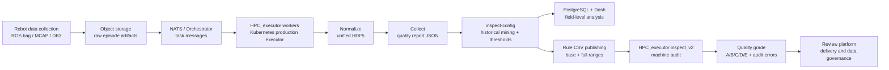
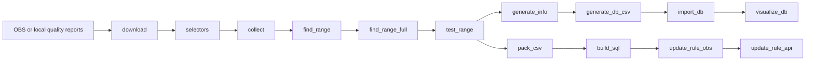

# inspect-config

[English](README.md) | [中文](README.zh-CN.md)


面向大规模机器人 telemetry 的配置驱动数据质量治理系统。

`inspect-config` 是完整数据质量系统中的离线规则生成、报告处理、数据库入库和可视化分析层。它与 `HPC_executor / production executor` 配合工作：后者是 Kubernetes/NATS 驱动的生产执行系统，负责归一化原始机器人数据、采集结构化质量报告、执行机器审核规则，并把质量等级返回给下游数据平台。

这份 README 按 GitHub 项目文档的方式组织，同时也把它作为作品集案例来展示：既说明这个仓库如何运行，也说明整个系统架构、工程价值和我在项目中的贡献。

## 案例概览

- **问题**：纯人工审核很难稳定发现大规模 telemetry 数据中的丢帧、摄像头卡顿、关节异常、字段缺失和不同构型的数据质量漂移。
- **方案**：构建一个闭环数据质量治理系统。生产 executor 生成质量报告，`inspect-config` 从历史报告中挖掘动态阈值，再把规则配置回流给 executor 做自动化机审。
- **结果**：支持字段级异常检测、多构型阈值生成、数据质量分级，以及面向审核和硬件问题定位的可视化分析。

## 系统上下文

`inspect-config` 不是整个生产系统本身。它更像控制面组件，负责把历史质量报告转换成可审计的规则和分析视图；`HPC_executor` 则是执行面，负责在生产中处理每条 episode。



在这套架构里，`HPC_executor` 负责热路径：download、normalize、collect、inspect、align、extract 和 upload。`inspect-config` 负责反馈闭环：聚合历史质量报告、推断字段阈值、验证规则、发布 CSV 配置、导入 PostgreSQL，并通过 Dash 提供异常分析界面。

## 项目价值

- **自动化质量治理**：用结构化质量报告和可复现机审规则替代人工逐字段检查。
- **多构型动态规则**：从历史分布中生成 model-specific 阈值，同时保留人工硬性标准的优先级。
- **闭环反馈**：生产报告进入 `inspect-config`，生成的规则 CSV 再回流到 `HPC_executor inspect_v2`。
- **数据质量分级**：根据轻微异常、严重异常、关键字段缺失和配置有效性输出 A/B/C/D/E 等级。
- **运维诊断能力**：Dash 可视化支持按 model、field、时间、SN、area、task 观察异常分布。
- **交付支持**：质量等级和规则失败详情可以支撑数据审核、异常定位和后续数据分级打包。

## 规模与影响

| 维度 | 脱敏规模 |
| --- | --- |
| 质量报告语料 | 约 500 万个 episode 级 JSON report |
| 历史报告体量 | 约 250 GB 结构化质量数据 |
| 生产并发 | 约 50-80 个 Kubernetes worker pod 消费任务队列 |
| 质量字段 | 每个构型通常 70-100 个质量字段 |

以上数字已经脱敏处理。本仓库不会包含私有 bucket 名称、凭据、部署路径或内部服务 URL。

## 我的贡献

- 围绕结构化质量报告，建设了 `collect` / `inspect` 数据质量工具链。
- 开发 `inspect-config`，用于下载历史报告、生成 selector、估计阈值、验证规则，并发布机审 CSV 配置。
- 增加 PostgreSQL 入库和 Plotly Dash 可视化，用于字段级异常分析。
- 将生成的配置回流到 `HPC_executor inspect_v2`，支撑动态机审 V2 和数据质量分级。
- 研发生产侧质量算法，包括帧稳定性、帧对齐、摄像头静止区间、关节运动区间、关节范围检查和 action/state 曲线拟合。

## inspect-config Pipeline

本仓库是一个可配置 Python pipeline。可以通过 `global.steps_to_run` 选择要运行的步骤，执行顺序保持固定。



## 功能亮点

- **配置优先**：通过 YAML 选择要执行的 workflow，不需要修改 Python 代码。
- **结构化 JSON 提取**：从嵌套质量报告中生成 selector，并采集匹配字段值。
- **阈值生成**：使用可配置统计方法生成 base range 和 full range。
- **验证闭环**：用采集数据回测阈值，并输出失败字段和统计信息。
- **数据库导出**：生成适合导入 PostgreSQL 的规范化 CSV 表。
- **交互式可视化**：通过 Dash/Plotly 查看 model、rule code、field、阈值和时间范围。
- **可选对象存储流程**：配置后可通过 `obsutil` 下载报告或上传生成的规则文件。

## 环境要求

- Python 3.11 或更新版本
- [uv](https://docs.astral.sh/uv/) 用于依赖管理
- PostgreSQL，用于 `import_db` 和 `visualize_db`
- 只有运行对象存储下载或上传步骤时才需要 `obsutil`

## 快速开始

安装依赖：

```bash
uv sync
```

检查并准备本地配置：

```bash
cp config.local.yaml.example config.local.yaml
```

运行当前配置指定的 pipeline：

```bash
uv run python src/run.py --config config.yaml
```

在支持 dry run 的步骤中尽量避免产生实际副作用：

```bash
uv run python src/run.py --config config.yaml --dry-run
```

开启 debug 日志：

```bash
uv run python src/run.py --config config.yaml --debug
```

## 配置说明

Pipeline 由 YAML 文件控制：

- `config.yaml`：项目共享配置和默认 step 设置。
- `config.local.yaml.example`：本地覆盖配置模板。
- `config.local.yaml`：Git 忽略文件，用于保存私有凭据、本机路径和数据库连接信息。

关键配置段：

- `global.steps_to_run`：选择要运行的 step。
- `global.enabled_areas`：启用 area 过滤时，限制处理范围。
- `download`：控制报告下载、CSV task list 模式、刷新策略和并发。
- `selectors`、`collect`、`find_range`、`find_range_full`、`test_range`：控制指标提取、阈值生成和验证。
- `generate_db_csv` 和 `import_db`：生成并导入 PostgreSQL 表。
- `visualize_db`：配置 Dash 服务和数据库连接。
- `update_rule_obs` 和 `update_rule_api`：在相关集成配置完成后发布生成的 rule artifacts。

## 常用流程

只启动可视化界面：

```yaml
global:
  steps_to_run:
    - visualize_db
```

然后运行：

```bash
uv run python src/run.py --config config.yaml
```

如果需要本地 PostgreSQL，可以使用项目内的 Compose 文件：

```bash
docker compose -f src/visualize_db_app/docker-compose.yml up -d
```

生成数据库 CSV 并导入：

```yaml
global:
  steps_to_run:
    - generate_db_csv
    - import_db
```

基于已经下载好的报告重新生成并验证阈值：

```yaml
global:
  steps_to_run:
    - selectors
    - collect
    - find_range
    - find_range_full
    - test_range
```

## 项目结构

```text
.
├── config.yaml
├── config.local.yaml.example
├── pyproject.toml
├── src
│   ├── run.py
│   ├── core
│   │   ├── config_loader.py
│   │   ├── logger.py
│   │   ├── pipeline.py
│   │   └── step_registry.py
│   ├── steps
│   │   ├── download.py
│   │   ├── selectors.py
│   │   ├── collect.py
│   │   ├── find_range.py
│   │   ├── generate_db_csv.py
│   │   ├── import_db.py
│   │   └── visualize_db.py
│   └── visualize_db_app
│       ├── app.py
│       ├── callbacks.py
│       ├── charts.py
│       ├── database.py
│       └── layout.py
└── uv.lock
```

## 安全说明

- 不要提交对象存储 access key、数据库密码、API token、bucket 名称、内部 URL 或真实生产路径。
- 私有覆盖配置应放在 `config.local.yaml`。
- 生成的 CSV、下载的 report、telemetry 派生数据都应按敏感数据处理。
- 任何曾经以明文形式提交或分享过的凭据，都应立即轮换。

## 开发说明

每个 pipeline step 位于 `src/steps`，并暴露 `run_step(repo_root, global_cfg, step_cfg, runtime)` 函数。Step 顺序声明在 `src/core/step_registry.py` 中，`src/core/pipeline.py` 负责在步骤之间共享 runtime context。

项目刻意保持 runner 简洁：主要行为由 step module 和 YAML 配置表达，而不是暴露大量命令参数。这样可以在保持 pipeline 可复现的同时，比较轻松地增加新的处理阶段。
